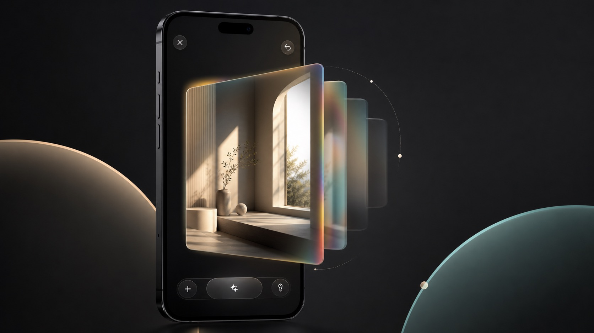

<div align="center">
  

  <h1>OpenReshoot</h1>

  <p><strong>Reshoot an ordinary photo from a new angle.</strong></p>

  <p>
    
    
    
    
    
  </p>

  <p>
    <a href="README.md">中文</a> ·
    <a href="https://github.com/kellyvv/OpenReshoot/issues">Issues</a> ·
    <a href="https://github.com/kellyvv/OpenReshoot/issues">Feature requests</a>
  </p>

  <p>
    <a href="#core-experience">Core Experience</a> ·
    <a href="#latest-status">Latest Status</a> ·
    <a href="#quick-start">Quick Start</a> ·
    <a href="#gemini-api-key">Gemini API Key</a> ·
    <a href="#local-web-prototype">Local Web Prototype</a> ·
    <a href="#license">License</a>
  </p>
</div>

OpenReshoot is a native iOS photo motion app. Pick a photo, drag inside a fixed frame, and the photo feels like it was captured from a different angle. When the view looks right, tap Reshoot to generate the final photo for that angle and save it back to the system photo library.

After WWDC 2026, spatial photos and angle-aware photo viewing became one of the most interesting iOS 27-era directions. Many users still cannot try that experience immediately because of system or device limits. OpenReshoot brings the idea of "view it from another angle, then reshoot it from that angle" to more iPhones and iPads.

## Core Experience

- Reshoot from a new angle: drag the photo and find a better angle or composition.
- Make still photos move: the photo changes perspective without moving the whole viewer.
- Generate the final image: when the angle feels right, Reshoot creates a clearer, more complete photo.
- Native iOS flow: system photo picker, native controls, and system photo library saving.
- Local photo motion: viewing the photo motion does not need an API key or a PC server.

## Latest Status

2026-06-11

- The iOS flow now matches the PC flow: pick a photo, view motion, reshoot the current angle, and save the result.
- The viewer includes glow, sheen, cover fade, and colorful missing-area treatment.
- The bottom controls now use a quieter PhoneClaw-style visual direction and blend directly into the background.
- The README, setup checker, and model preparation scripts have been cleaned up for new contributors.

## Quick Start

Requirements:

- macOS with Xcode 15 or newer.
- XcodeGen: `brew install xcodegen`
- Python dependencies: `pip install -r requirements-ios.txt`
- A real iPhone or iPad on iOS 18 or newer.

Prepare the project:

```bash
git clone https://github.com/kellyvv/OpenReshoot.git
cd OpenReshoot
scripts/check_openreshoot_setup.sh
scripts/prepare_ios_model.sh
cd ios
xcodegen generate
open OpenReshoot.xcodeproj
```

In Xcode, select the `OpenReshoot` target, set your signing team, choose a real iOS device, and run.

More iOS-specific details are in [ios/README.md](ios/README.md).

## Gemini API Key

OpenReshoot currently uses `gemini-3.1-flash-image` to generate the final Reshoot photo. The app does not include a shared public API key, so users need to enter their own Gemini API key.

Setup:

1. Open [Google AI Studio API Keys](https://aistudio.google.com/apikey), sign in, and create a Gemini API key.
2. In the iOS app, tap the key button in the bottom-right corner.
3. Paste the API key and save it.
4. Return to the photo, drag to the angle you want, then tap Reshoot.

The local photo motion experience does not need an API key. Gemini is only used when the user taps Reshoot. Do not commit your API key to GitHub.

## Local Web Prototype

The repository keeps the Python / MPS web prototype mainly for contributors who want to compare the iOS result with the PC flow. Regular iOS use does not require it.

```bash
pip install -r requirements-web.txt
export GEMINI_API_KEY="your-key"
bash run.sh
```

Then open `http://127.0.0.1:8765/splat/`.

## Contributing

Issues, screenshots, and short reproduction videos are welcome. For iOS viewer, photo motion, Gemini Reshoot, or save-flow bugs, please include the device model, iOS version, and a concise reproduction path.

## License

See [LICENSE](LICENSE) for the source license and [LICENSE_MODEL](LICENSE_MODEL) for the released model license. Also see [ACKNOWLEDGEMENTS](ACKNOWLEDGEMENTS) for upstream open-source notices.
